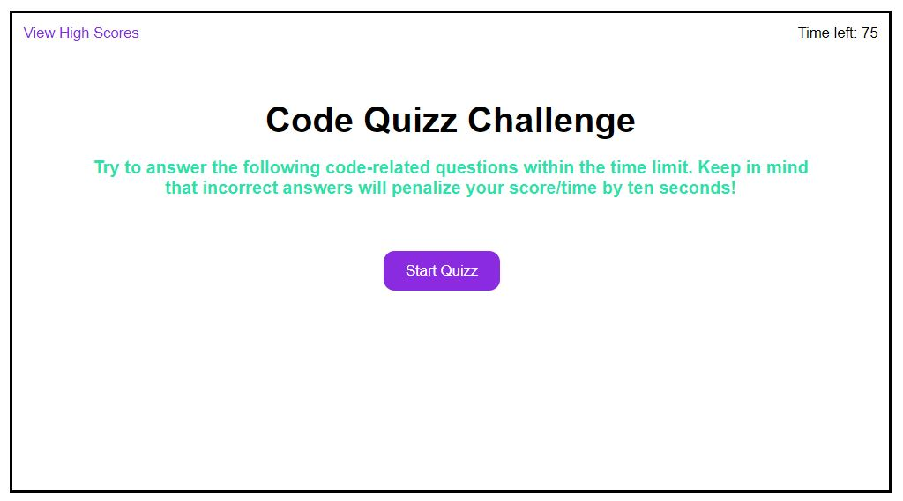
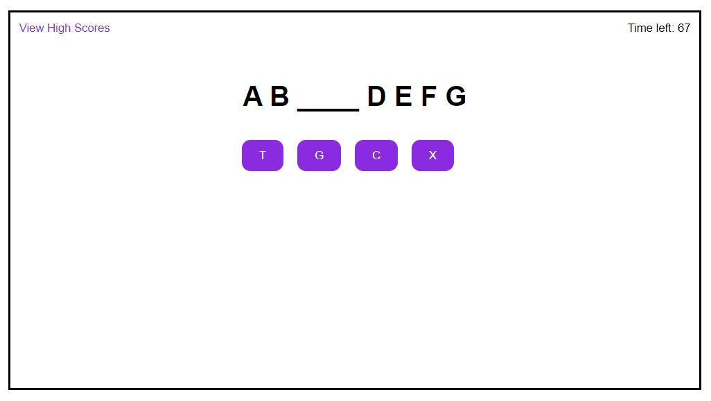
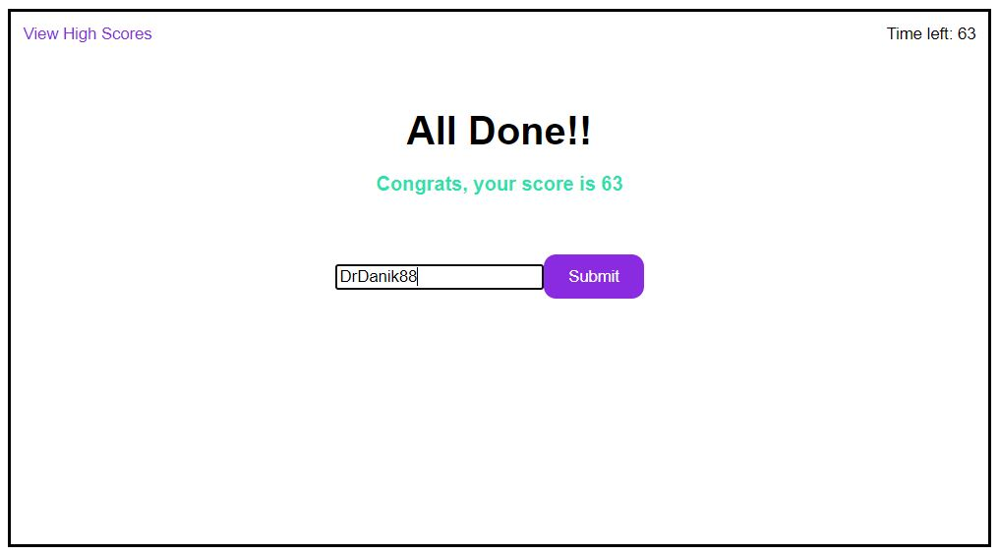
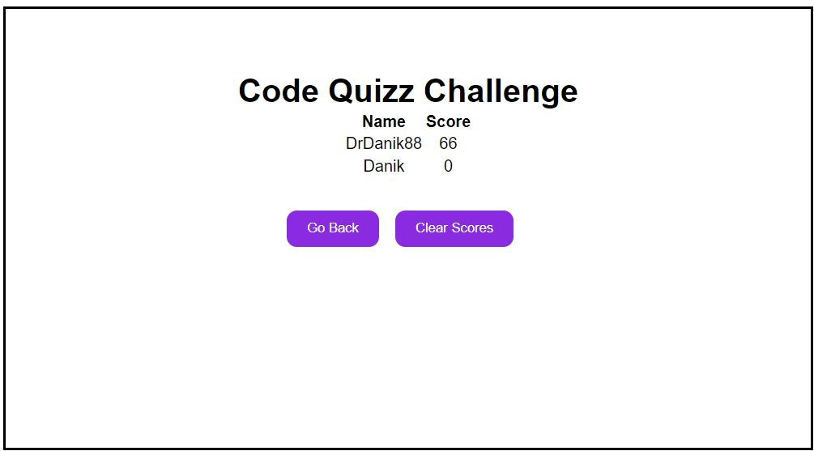

  # Quizz

## Description

Provide a short description explaining the what, why, and how of your project. Use the following questions as a guide:

- What was your motivation? I wanted to learn and practive to play with functions. 
I built this because I needed to apply what we've learned in class. I understand the code is not as elegant as it should be and there is also a ton of variables, but I wanted to make sure everything was accessible all the time.
- What problem does it solve?
Well, I just goes about to show that, that I am able to write something from scratch. It doesn't solve a particular problem per say. 
- What did you learn?
Functions, functions functions and Arrays as well. 

## Installation

Just copy the full repo, launch Index.html and you should be good to go.
or try this link:
https://drdanik88.github.io/quizz/

## Usage

## Credits

Credits to Ashley for helping me make sense of some lines.
Credits to Open.Ai ChatGPT for answering all of my questions.
Credits to the two persons from AskBCS who helped me with the timer and the array for the hiscores.

## License

None, do what you have to do.

---